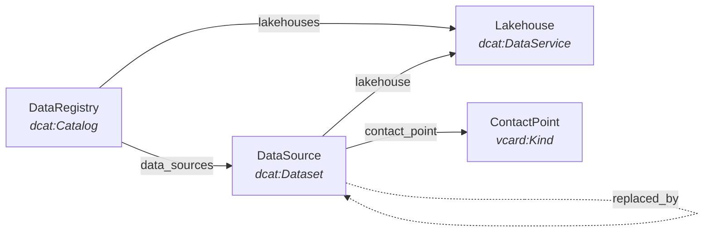

# BER Data Registry

**A standards-based metadata catalog for scientific data sources across BER-funded lakehouses at Lawrence Berkeley National Laboratory.**

Built with [LinkML](https://linkml.io/) and aligned with
[DCAT v3](https://www.w3.org/TR/vocab-dcat-3/),
[DCAT-US](https://resources.data.gov/resources/dcat-us/), and
[schema.org](https://schema.org/).

---

## What is the BER Data Registry?

The BER Data Registry provides a common metadata schema for describing, discovering,
and governing data sources across scientific lakehouses operated by LBNL in support
of the Department of Energy's Biological and Environmental Research (BER) program.

It gives data stewards, researchers, and engineers a single vocabulary to catalog
data assets spanning multiple platforms — from the KBASE Spark lakehouse at NERSC
to Dremio-based environments — while staying aligned with federal data cataloging
standards.

## Key Features

- **Standards-aligned** -- Maps directly to DCAT v3, Dublin Core, vCard, and PROV
  vocabularies so metadata is interoperable from day one
- **Multi-platform** -- Covers Spark and Dremio lakehouses with source-type and
  database-engine detail
- **Rich metadata** -- 40+ fields per data source including ownership, access level,
  update schedule, temporal/spatial coverage, and DOI
- **Lifecycle tracking** -- Version history, deprecation chains, and provenance for
  every data source
- **FAIR-compliant** -- Supports findable, accessible, interoperable, and reusable
  metadata for scientific datasets
- **Extensible** -- Built on LinkML, making it straightforward to add fields and
  enumerations as requirements evolve

## Core Schema at a Glance



| Class | DCAT Mapping | Role |
|-------|-------------|------|
| **DataRegistry** | `dcat:Catalog` | Top-level container for lakehouses and data sources |
| **Lakehouse** | `dcat:DataService` | A hosting platform (Spark, Dremio) |
| **DataSource** | `dcat:Dataset` | A cataloged data source with full metadata |
| **ContactPoint** | `vcard:Kind` | Contact information for a data source owner |

## Quick Start

**1. Browse the schema** -- See the full [schema documentation](elements/index.md)
for all classes, fields, and enumerations.

**2. Look at examples** -- The [examples page](examples.md) has annotated YAML files
you can download and use as templates, from a minimal single-source registry to
multi-source Dremio configurations with deprecation chains.

**3. Validate your data** -- Install the registry and validate a YAML file against
the schema:

```bash
pip install ber-data-registry
linkml-validate -s src/ber_data_registry/schema/ber_data_registry.yaml your-file.yaml
```

## Learn More

- [Schema Documentation](elements/index.md) -- Auto-generated reference for every
  class, slot, enum, and type
- [Examples](examples.md) -- Downloadable YAML examples with walkthroughs
- [About](about.md) -- Project goals, background, design principles, and how to
  contribute
- [GitHub Repository](https://github.com/sierra-moxon/ber-data-registry) -- Source
  code, issues, and CI/CD
